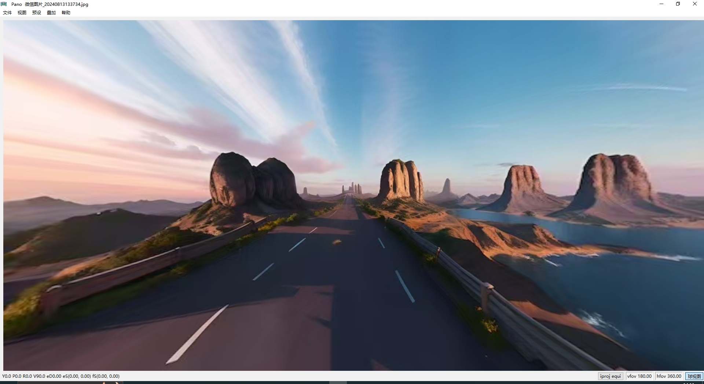

# PanoViewer

#### 介绍
全景图浏览软件

#### 软件截图



## 构建

项目已改为 CMake + Qt 6 工程，渲染后端使用 Qt QRhi。需要 Qt 6.7 或更新版本。

```powershell
cmake -S . -B build -G Ninja -DCMAKE_PREFIX_PATH="D:/Qt/6.11.1/msvc2022_64"
cmake --build build
```

如果 Qt 已经在 PATH/CMake package path 中，可以省略 `CMAKE_PREFIX_PATH`。
